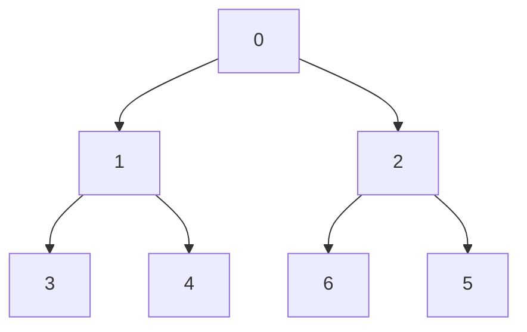

# Trees

## Types
### Perfect trees
All positions covered in all levels
### Complete trees
Filled continuously left to right
### Full tress
All nodes have two child nodes
### Balanced trees
Doesn't overconcentrate nodes, that is...
The absolute height diff between any left-right subtrees is 1
### Degenerate trees
Suboptimal epitome that's actually a linked list
